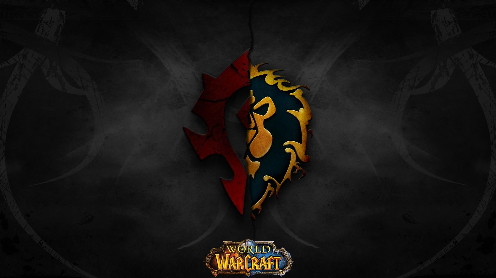

# WoW_Mythic_Raiding_Leaderboard_Dashboard

  

## Objective
* Deploy a dashboard that pulls data from an API and updates itself accordingly.
                      * [Dashboard](https://wow-bfa-mythic-raid-lbapp.herokuapp.com/)

## Background Information
* World of Warcraft (WoW) is a massively multiplayer online role-playing game (MMORPG), which set records for the most subscribers in a video game. There are many gameplay aspects in WoW, but for this analysis we'll focus on the mythic raiding leaderboard. Players coordinate amongst each other to defeat high-level enemies in a dungeon and are ranked accordingly. The leaderboard is split for the two factions playable in WoW: Alliance and Horde. 

## Dataset
* The dataset was pulled real-time by using the Blizzard API. The dataframes are split for each raid and faction selected.

## Process:
* Dashboard deploying utilizing various python packages (Dash, Numpy, Matplotlib, Pandas, and Plotly).

## Table of Contents:
* Part I: Dashboard
    * Produced with plotly-dash and deployed by heroku.
    
    
 ## Future Development
 * Scale the amount of workers to increase productivity of application.
 * Optimize code for intermediate values to not recall functions.
 * Add in a feature which examines the guild roster.
